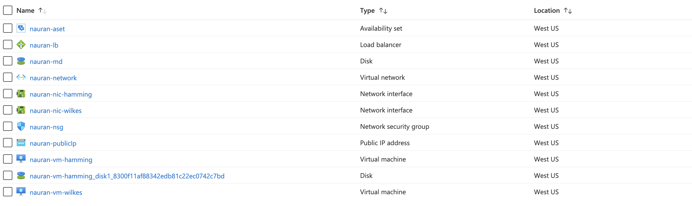

# Azure Infrastructure Operations Project: Deploying a scalable IaaS web server in Azure

### Introduction
This project aims to create a simple scalable web server in Azure with the help of Packer, Terraform templates.

### Getting Started
1. Clone this repository
2. Create an [Azure Account](https://portal.azure.com) 
3. Install the [Azure command line interface](https://docs.microsoft.com/en-us/cli/azure/install-azure-cli?view=azure-cli-latest)
4. Install [Packer](https://www.packer.io/downloads)
5. Install [Terraform](https://www.terraform.io/downloads.html)

### Instructions

Once you've installed all the above dependencies, you need to do the following: 

### Deploying the Packer Image

We can use Packer to create the OS image that we are going to deploy in this project. 
You can go ahead and change the values in the `server.json` to customize the image. (Eg: Changing the Ubuntu version etc)

Go to the terminal and export the environment variables like below.

```bash
export ARM_CLIENT_ID=<Your_Own_Value_Here>
export ARM_CLIENT_SECRET=<Your_Own_Value_Here>
export ARM_SUBSCRIPTION_ID=<Your_Own_Value_Here>
```

#### Deploy the Packer Image :  

Run the following command to deploy the packer image.

```bash
packer build server.json
```

It will take some time to build the image. Once the image is built, you can view it in the Azure portal. 
Take note of the `RESOURCE ID` which we will use in the next section.

## Deploy the infrastructure with Terraform

#### Specify the Variables

In `main.tf`, you can see that the infrastructure has been defined. The variables are defined in `vars.tf`. You can customize them the way you want. 

```tf
variable "reason" {
  description = "The reason for creating this resources"
  default = "Project A"
}
```

And in your main.tf, you can call the variables like

```tf
var.reason
```

Replace the packerImageId with the `RESOURCE ID` you got above after building the packer Image.

variable "packerImageId"{
  default = "<Place_your_resource_id_here>"
}

#### Deploy the Infrastructure

Now we come to deploy the resources using the Terraform template. 

Run the following commands to deploy the infrastructure.

```bash
az login
```

You can have a look at the resources that are going to be created by running the following command.
```bash
terraform plan 
```

Once you are satisfied with the plan, you can deploy it.
```bash
terraform apply
```

Once you have deployed the infrastructure. You can go to the Azure portal to check the resources. Once you have finished, remember to destroy these resources.

```bash
terraform destroy
```

## Output

In the terminal, type `terraform show` to check the resources. It will show the resources that are deployed.

```bash
terraform show
```

You can also check whether these resources are deployed by looking at the Azure portal.


You can visit the server by visiting the public ip in the browser. (You can view the public IP in the portal)

```
http://<your-public-ip-here>/
```

After the deployment, remember to destroy the resources.

``` bash
terraform destroy
```

